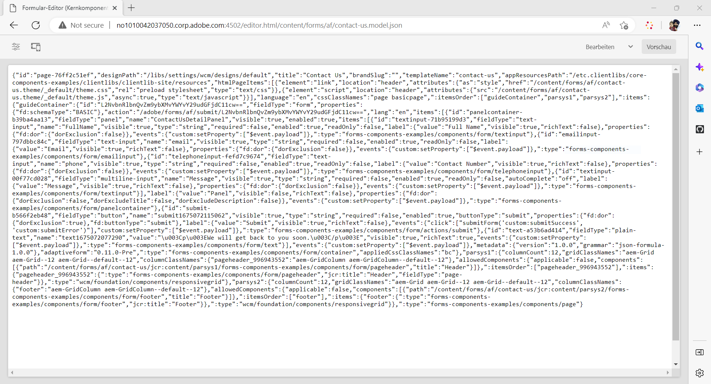

# Erstellen eines Headless-adaptiven Formulars mit dem adaptiven Forms-Editor {#create-a-headless-adaptive-form-using-adaptive-forms-editor}

AEM Forms as a Cloud Service bietet einen benutzerfreundlichen Editor zum Erstellen von Headless Adaptive Forms. Mit mehr als 24 Kernkomponenten können Sie ein Formular einfach erstellen, indem Sie Komponenten per Drag-and-Drop in den Editor ziehen. Darüber hinaus können Sie mit dem Regeleditor Validierungen zu Ihren Formularfeldern hinzufügen.

>[!NOTE]
>
> 
>Wenn Sie mit Headless Adaptive Forms noch nicht vertraut sind, empfiehlt Adobe, das [Erstellen und Veröffentlichen eines Headless-Formulars mit dem Starter Kit](create-and-publish-a-headless-form.md) Tutorial zu den Grundlagen und zum Erstellen eines Headless-adaptiven Formulars vor der Verwendung des Adaptiven Forms-Editors für Headless-Formulare.

Führen Sie die folgenden Schritte aus, um ein Headless-adaptives Formular mit dem adaptiven Forms-Editor zu erstellen:

## Bevor Sie beginnen:

Sie benötigen Folgendes, um ein adaptives Formular mit dem adaptiven Forms-Editor zu erstellen:

**Für AEM 6.5 Forms:**

* Zugriff auf eine AEM 6.5.16.0 oder höher Forms-Autoreninstanz.

* Kernkomponenten für adaptive Formulare

* Vorlage für adaptive Forms-Kernkomponenten

* Ein Thema für ein adaptives Formular für eine Vorlage, die auf Kernkomponenten basiert

* Benutzer hinzufügen zu [!DNL forms-users] hinzugefügt. Die Mitglieder der [!DNL forms-users]-Gruppe sind berechtigt, ein adaptives Formular zu erstellen.

**Für AEM Forms as a Cloud Service:**

* Zugriff auf eine [as a Cloud Service Autoreninstanz von AEM Forms](https://experienceleague.adobe.com/docs/experience-manager-cloud-service/content/forms/setup-configure-migrate/setup-forms-cloud-service.html?lang=en) oder [as a Cloud Service AEM Forms-SDK](https://experienceleague.adobe.com/docs/experience-manager-cloud-service/content/forms/setup-configure-migrate/setup-local-development-environment.html?lang=en) Umgebung.

* **Eine adaptive Formularvorlage**: Eine Vorlage liefert eine Grundstruktur und definiert das Erscheinungsbild (Layouts und Stile) eines adaptiven Formulars. Es enthält vorformatierte Komponenten einschließlich bestimmter Eigenschaften und einer Struktur für Inhalte. Es bietet außerdem die Optionen zum Definieren eines Designs und einer Übermittlungsaktion. Das Design definiert den Look-and-Feel und die Übermittlungsaktion definiert die Aktion, die bei der Übermittlung eines adaptiven Formulars ausgeführt werden soll. Senden der erfassten Daten an eine Datenquelle. Der Cloud-Service bietet eine OOTB-Vorlage mit leerem Namen:

   * Die Vorlage `blank Adaptive Forms (Core Components)` ist in jedem neuen AEM Forms as a Cloud Service-Programm enthalten.
   * Sie können auch [eine neue Vorlage für adaptive Forms (Kernkomponenten) erstellen](https://experienceleague.adobe.com/docs/experience-manager-cloud-service/content/forms/adaptive-forms-authoring/authoring-adaptive-forms-foundation-components/create-an-adaptive-form-on-forms-cs/template-editor.html) von Grund auf neu.

* **Ein adaptives Formular**: Ein Design enthält Stildetails für die Komponenten und Bedienfelder. Die Stile umfassen Eigenschaften wie Hintergrundfarben, Statusfarben, Transparenz, Ausrichtung und Größe. Wenn Sie ein Design anwenden, spiegeln die entsprechenden Komponenten den angegebenen Stil wider.  Die Vorlage `Canvas` ist in jedem neuen AEM Forms as a Cloud Service-Programm enthalten.

* **Berechtigungen**: Fügen Sie Ihre Benutzerinnen und Benutzer zur Gruppe [!DNL forms-users] hinzu. Die Mitglieder der [!DNL forms-users]-Gruppe sind berechtigt, ein adaptives Formular zu erstellen. Eine detaillierte Liste der formularspezifischen Benutzergruppen finden Sie unter [Gruppen und Berechtigungen](https://experienceleague.adobe.com/docs/experience-manager-cloud-service/content/forms/setup-configure-migrate/forms-groups-privileges-tasks.html).

## Erstellen eines adaptiven Formulars  {#create-an-adaptive-form-components}

1. Melden Sie sich bei Ihrer AEM-Autoreninstanz bei [!DNL Experience Manager Forms] an.

1. Geben Sie Ihre Anmeldedaten auf der Experience Manager-Anmeldeseite ein. Wenn Sie sich angemeldet haben, tippen Sie in der oberen linken Ecke auf **[!UICONTROL Adobe Experience Manager]** > **[!UICONTROL Formulare]** > **[!UICONTROL Formulare und Dokumente]**.

1. Tippen Sie auf **[!UICONTROL Erstellen]** > **[!UICONTROL Adaptives Formular]**. Der Assistent wird geöffnet. Wählen Sie auf der Registerkarte „Quelle“ eine Vorlage aus:

   

   Wenn Sie eine Vorlage auswählen, werden ein Design und eine in der Vorlage angegebene Sendeaktion automatisch ausgewählt und die Schaltfläche **[!UICONTROL Erstellen]** wird aktiviert. Sie können zu den Registerkarten **[!UICONTROL Stil]** oder **[!UICONTROL Übermittlung]** gehen, um ein anderes Design oder eine andere Übermittlungsaktion auszuwählen. Wenn in der ausgewählten Vorlage kein Design angegeben wird, bleibt die Schaltfläche „Erstellen“ deaktiviert. Sie können zur Registerkarte **[!UICONTROL Stile]** gehen, um ein Design manuell auszuwählen.

1. Wählen Sie auf der Registerkarte **[!UICONTROL Stil]** ein Design aus:

   * Wenn die ausgewählte Vorlage ein Design angibt, wird das Design automatisch im Assistenten ausgewählt. Sie können auch auf der Registerkarte „Stil“ ein anderes Design auswählen.

   * Wenn in der ausgewählten Vorlage kein Design angegeben ist, können Sie auf der Registerkarte „Stil“ ein Design auswählen. Die **[!UICONTROL Erstellen]**-Schaltfläche wird erst aktiviert, nachdem ein Design ausgewählt wurde.

1. (Optional) Wählen Sie auf der Registerkarte „Daten“ ein Datenmodell aus:

   * **Formulardatenmodell**: Ein [Formulardatenmodell](https://experienceleague.adobe.com/docs/experience-manager-cloud-service/content/forms/integrate/use-form-data-model/data-integration.html) ermöglicht Ihnen die Integration von Entitäten und Diensten aus unterschiedlichen Datenquellen in ein adaptives Formular. Wählen Sie das Formulardatenmodell, wenn Sie ein adaptives Formular erstellen, für das Daten aus mehreren Datenquellen abgerufen und in sie geschrieben werden sollen.

   * **JSON-Schema**: [JSON-Schema](https://experienceleague.adobe.com/docs/experience-manager-cloud-service/content/forms/adaptive-forms-authoring/authoring-adaptive-forms-foundation-components/create-an-adaptive-form-on-forms-cs/adaptive-form-json-schema-form-model.html?lang=en) Adaptive Formulare ermöglichen eine nahtlose Integration in das Back-End-System Ihres Unternehmens, indem sie die Möglichkeit bieten, ein JSON-Schema zu verknüpfen, das die Struktur der erzeugten oder verwendeten Daten darstellt. Diese Zuordnung ermöglicht es Autorinnen und Autoren, dem adaptiven Formular mithilfe der Elemente des Schemas dynamisch Inhalte hinzuzufügen. Die Elemente des Schemas sind auf der Registerkarte „Datenmodellobjekte“ des Inhaltsbrowsers während des Erstellungsprozesses leicht zugänglich, und alle Felder werden automatisch zu jedem neu erstellten adaptiven Formular hinzugefügt.

   Standardmäßig werden alle Felder des zugehörigen JSON-Schemas automatisch ausgewählt und in entsprechende adaptive Formularkomponenten konvertiert, was den Erstellungsprozess vereinfacht. Der Assistent bietet einen zusätzlichen Komfort, mit dem Sie mithilfe von Kontrollkästchen selektiv festlegen können, welche Felder in das adaptive Formular aufgenommen werden sollen.

1. Wählen Sie auf der Registerkarte **[!UICONTROL Übermittlung]** eine Übermittlungsaktion aus:

   * Wenn Sie eine Vorlage auswählen, wird die in der Vorlage angegebene Übermittlungsaktion automatisch ausgewählt. Sie können auf der Registerkarte „Übermittlung“ eine andere Übermittlungsaktion auswählen. Auf der Registerkarte **[!UICONTROL Übermittlung]** werden alle verfügbaren Übermittlungsaktionen angezeigt.

   * Wenn die ausgewählte Vorlage keine Übermittlungsaktion angibt, können Sie auf der Registerkarte **[!UICONTROL Übermittlung]** eine Übermittlungsaktion auswählen

1. (Optional) Auf der Registerkarte **[!UICONTROL Versand]** können Sie ein Datum für die Veröffentlichung oder das Rückgängigmachen der Veröffentlichung eines adaptiven Formulars angeben.

1. Tippen Sie auf **[!UICONTROL Erstellen]**. Es wird ein Dialogfeld angezeigt, in dem Sie den Titel, Namen und Speicherort des adaptiven Formulars angeben können:

   * **[!UICONTROL Titel:]** Gibt den Anzeigenamen des Formulars an. Der Titel erleichtert Ihnen die Identifizierung des Formulars in der Benutzeroberfläche von [!DNL Experience Manager Forms].
   * **[!UICONTROL Name:]** Gibt den Namen des Formulars an. Im Repository wird ein Knoten mit dem angegebenen Namen erstellt. Wenn Sie mit der Eingabe des Titels beginnen, wird automatisch ein Wert für das Feld „Name“ vorgeschlagen. Sie können den vorgeschlagenen Wert gegebenenfalls ändern. Im Feld „Name“ dürfen nur alphanumerische Zeichen, Bindestriche und Unterstriche eingegeben werden. Alle ungültigen Eingaben werden durch Bindestriche ersetzt.
   * **[!UICONTROL Pfad:]** Gibt den Speicherort an, an dem das adaptive Formular gespeichert werden soll. Sie können das adaptive Formular direkt unter `/content/dam/formsanddocuments` erstellen oder einen Ordner wie `/content/dam/formsanddocuments/adaptiveforms` anlegen, um ein adaptives Formular zu speichern. Stellen Sie sicher, dass Sie den Ordner erstellen, bevor Sie ihn im Pfad verwenden. Das Feld **[!UICONTROL Pfad]** erstellt nicht automatisch einen Ordner.

1. Tippen Sie auf **[!UICONTROL Erstellen]**. Ein adaptives Formular wird erstellt und im Editor für adaptive Formulare geöffnet. Der Editor zeigt die in der Vorlage verfügbaren Inhalte an.  Je nach Typ des adaptiven Formulars werden auf der Registerkarte **[!UICONTROL Datenmodellobjekte]** des **[!UICONTROL Content-Browsers]** in der Seitenleiste die Formularelemente angezeigt, die im zugewiesenen <!--XFA form template, XML schema or -->-JSON-Schema oder Formulardatenmodell vorhanden sind. Sie können diese Elemente auch per Drag-and-Drop in das zu erstellende adaptive Formular ziehen.

Jetzt können Sie die adaptiven Forms-Komponenten per Drag &amp; Drop in den adaptiven Forms-Container ziehen, um das Formular zu entwerfen und zu erstellen.

## Anzeigen der JSON-Wiedergabe eines adaptiven Formulars {#preview-form}

Wählen Sie das adaptive Formular aus und tippen Sie auf **Vorschau**. Die Vorschau des Formulars wird angezeigt. Um die Formulardefinition (JSON) des Formulars anzuzeigen, ersetzen Sie die .html-Erweiterung in der URL durch .model.json

Beispiel: http://[author-server]:[port]/editor.html/content/forms/af/contact-us.model.json

Sie können die Headless-Adaptive Forms verwenden [getForm](https://opensource.adobe.com/aem-forms-af-runtime/api/#tag/Get-Form-Definition) API, um die Formulardefinition (JSON) abzurufen und sie in Ihrer Anwendung zu verwenden.

