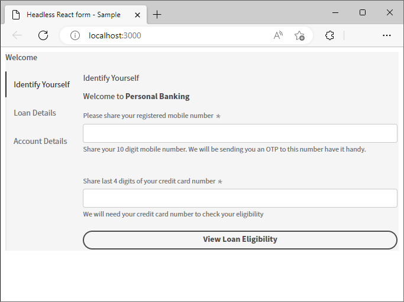
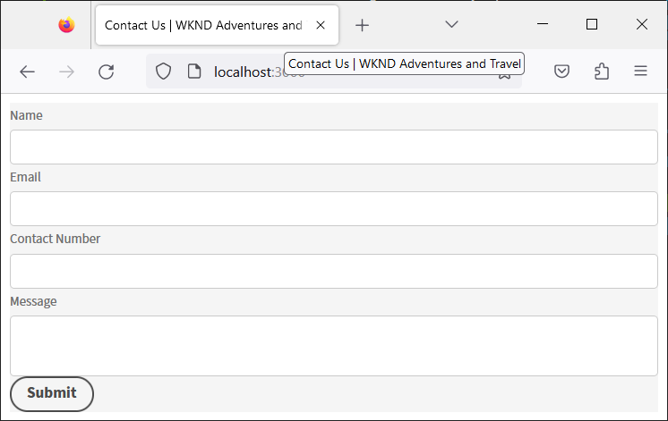

# Erstellen und Anzeigen einer Vorschau eines Headless-Formulars mit einer React-App {#introduction}

Das Starter Kit hilft Ihnen bei den ersten Schritten mit einer React-App. Sie können adaptive Formulare ohne Headless-Funktionalität in einer Angular, Vanilla JS und anderen Entwicklungsumgebungen Ihrer Wahl entwickeln und verwenden.

Mit Headless-adaptiven Formularen zu beginnen ist ziemlich einfach und schnell. Klonen Sie das fertige React-Projekt, installieren Sie die Abhängigkeiten und führen Sie das Projekt aus. Sie verfügen über ein Headless-adaptives Formular, das in eine React-App integriert ist. Sie können das Beispiel-React-Projekt verwenden, um Headless-adaptive Formulare zu erstellen und zu testen, bevor Sie es in einer Produktionsumgebung bereitstellen.

Fangen wir an:

>[!NOTE]
>
>
> In diesem Erste-Schritte-Handbuch wird eine React-App verwendet. Es steht Ihnen frei, Technologien oder Programmiersprachen Ihrer Wahl zu verwenden, um Headless-adaptive Formulare zu verwenden.

## Bevor Sie beginnen {#pre-requisites}

Um eine React-App zu erstellen und auszuführen, muss auf Ihrem Computer Folgendes installiert sein:

* Installieren Sie die [neueste Version von Git](https://git-scm.com/downloads). Wenn Sie mit Git noch nicht vertraut sind, lesen Sie [Installieren von Git](https://git-scm.com/book/en/v2/Getting-Started-Installing-Git).

* Installieren [Node.js 16.13.0 oder höher](https://nodejs.org/de/download/). Wenn Sie mit Node.js noch nicht vertraut sind, lesen Sie [Installieren von Node.js](https://nodejs.dev/en/learn/how-to-install-nodejs).

## Erste Schritte

Nachdem Sie die Anforderungen erfüllt haben, führen Sie die folgenden Schritte aus, um zu beginnen:

1. [Einrichten des Starterkits für Headless-adaptive Formulare](#setup)

1. [Anzeigen einer Vorschau des adaptiven Formulars ohne Kopfzeilenfunktion im Starterkit](#preview)

1. [Erstellen und Rendern eines eigenen adaptiven Formulars mit Headless-Funktionalität](#custom)


## 1. Einrichten des Starterkits für Headless-adaptive Formulare {#install}

Das Starterkit ist eine React-App mit einem Headless-Beispielformular und entsprechenden Bibliotheken. Verwenden Sie das Kit, um Ihre Headless-adaptiven Formulare und entsprechenden React-Komponenten zu entwickeln und zu testen. Führen Sie die folgenden Befehle aus, um das Starterkit für Headless-adaptive Formulare einzurichten:

1. Öffnen Sie die Eingabeaufforderung und führen Sie den folgenden Befehl aus:

   ```shell
   git clone https://github.com/adobe/react-starter-kit-aem-headless-forms
   ```

   Der Befehl erstellt ein Verzeichnis mit dem Namen **react-starter-kit-aem-headless-forms** an Ihrem aktuellen Speicherort und klont die App &quot;React Starter&quot;für Headless-adaptive Formulare. Zusammen mit den Konfigurationen und der Liste der Abhängigkeiten, die zum Rendern des Formulars erforderlich sind, enthält der Ordner die folgenden wichtigen Inhalte:

   * **Beispielformular**: Das Starter-Kit enthält ein Beispielformular für einen Kreditantrag. Um das in der App enthaltene Formular (Formulardefinition) anzuzeigen, öffnen Sie die `/react-starter-kit-aem-headless-forms/form-definations/form-model.json` -Datei.
   * **Beispiele für Reaktionskomponenten**: Das Starter-Kit enthält Beispiel-React-Komponenten für Rich Text und Slider. Dieses Handbuch hilft Ihnen beim Erstellen eigener benutzerdefinierter Komponenten mit diesen Rich-Text- und Slider-Komponenten.
   * **Mappings.ts**: Mithilfe der Datei &quot;mappings.ts&quot;können Sie benutzerdefinierte Komponenten Formularfeldern zuordnen. Sie können beispielsweise ein numerisches Schrittfeld der Bewertungskomponente zuordnen.
   * **Umgebungskonfigurationen**: Mit Umgebungskonfigurationen können Sie ein im Starter Kit enthaltenes Formular wiedergeben oder ein Formular von einem AEM Forms-Server abrufen.

   

   >[!NOTE]
   >
   > 
   > Beispiele in Dokumenten basieren auf VSCode. Sie können auch einen beliebigen Code-Editor für einfache Texte verwenden.


1. Navigieren Sie zum **react-starter-kit-aem-headless-forms** und führen Sie den folgenden Befehl aus, um die Abhängigkeiten zu installieren:

   ```shell
   npm install
   ```

   Der Befehl lädt alle Pakete und Bibliotheken herunter, die zum Ausführen und Erstellen der App erforderlich sind, z. B. Headless-Bibliotheken für adaptive Formulare (@aemforms/af-response-renderer, @aemforms/af-response-components, @adobe/react-frequency), führt Überprüfungen durch und behält Daten für Instanzen des Formulars bei.

   


## 2. Vorschau des adaptiven Formulars ohne Kopfzeile {#preview}

Nachdem Sie das Starter-Kit eingerichtet haben, können Sie eine Vorschau des adaptiven Beispielformulars vom Typ Headless anzeigen und es durch Ihr eigenes benutzerdefiniertes Formular ersetzen. Sie können auch das Starter Kit konfigurieren, um ein Formular von einem AEM Forms-Server abzurufen. Formularvorschau

1. Benennen Sie die `env_template` Datei in `.env` -Datei. Stellen Sie außerdem sicher, dass die Option USE_LOCAL_JSON auf &quot;true&quot;gesetzt ist.

   

   <!-- The options in the .env file help you configure source of the forms definantion (.JSON):
    *  To source forms definantion (.JSON) from an AEM Server, set USE_LOCAL_JSON option to false, use the AEM_URL option to specify URL  of your AEM Server, and set the AEM_FORM_PATH option to path of your adaptive form.
    *  To source forms definantion (.JSON) form-model.json file included in the starter-kit, set USE_LOCAL_JSON option to false. -->

1. Verwenden Sie den folgenden Befehl, um die App auszuführen:

   ```shell
     npm start
   ```


   Mit diesem Befehl wird ein lokaler Entwicklungsserver gestartet und das in der Starter App enthaltene adaptive Beispielformular Headless wird in Ihrem Standard-Webbrowser geöffnet.

   

   Voila! Sie sind alle so eingerichtet, dass Sie mit der Entwicklung eines benutzerdefinierten Headless-adaptiven Formulars beginnen.

   <!--  As you know, in a headless form the form data and logic are separate from the presentation layer and can be used by any client that can make HTTP requests, such as a mobile app, a static site, or a different web application. The form is often managed and stored on a server, which serves as the backend for the form. The client sends requests to the server to retrieve the form, submit data, and receive updated form data. This allows for greater flexibility and integration with different technologies. You can store and retrive a Headless adaptive form on an AEM Server  -->

## 3. Erstellen und Rendern Ihres eigenen adaptiven Headless-Formulars{#custom}

Ein Headless-adaptives Formular stellt das Formular und seine Komponenten, wie Felder und Schaltflächen, im JSON-Format (JavaScript Object Notation) dar. Der Vorteil der Verwendung des JSON-Formats besteht darin, dass es von verschiedenen Programmiersprachen einfach analysiert und verwendet werden kann, sodass Formulardaten bequem zwischen Systemen ausgetauscht werden können. Um das in der App enthaltene adaptive Beispielformular ohne Kopfzeile anzuzeigen, öffnen Sie die `/react-starter-kit-aem-headless-forms/form-definations/form-model.json` -Datei.

Erstellen wir ein Kontaktformular mit vier Feldern: &quot;Name&quot;, &quot;E-Mail&quot;, &quot;Kontaktnummer&quot;und &quot;Nachricht&quot;. Die Felder werden als Objekte (Elemente) innerhalb der JSON definiert, wobei jedes Objekt (Element) Eigenschaften wie Typ, Bezeichnung, Name und erforderlich hat. Das Formular verfügt auch über eine Schaltfläche vom Typ &quot;Senden&quot;. Hier finden Sie JSON für das Formular.


```JSON
{
  "afModelDefinition": {
    "adaptiveform": "0.10.0",
    "items": [
      {
        "fieldType": "text-input",
        "label": {
          "value": "Name"
        },
        "name": "name"
      },
      {
        "fieldType": "text-input",
        "format": "email",
        "label": {
          "value": "Email"
        },
        "name": "email"
      },
      {
        "fieldType": "text-input",
        "format": "phone",
        "pattern": "[0-9]{10}",
        "label": {
          "value": "Contact Number"
        },
        "name": "Phone"
      },
      {
        "fieldType": "multiline-input",
        "label": {
          "value":"Message"
        },
        "name": "message"
      },
      {
        "fieldType": "button",
        "label":{
          "value": "Submit"
        },
        "name":"submit",
        "events":{
          "click": "submitForm()"
        }
      }
    ],
    "action": "https://eozrmb1rwsmofct.m.pipedream.net",
    "description": "Contact Us",
    "title": "Contact Us",
    "metadata": {
      "grammar": "json-formula-1.0.0",
      "version": "1.0.0"
    }
  }
}
```

>[!NOTE]
>
> * Das Attribut &quot;afModelDefinition&quot;ist nur für React-Anwendungen erforderlich und ist nicht Teil der Formulardefinition.
> * Sie können das Formular JSON manuell erstellen oder die [AEM Editor für adaptive Formulare (WYSIWYG-Editor für adaptive Formulare)](create-a-headless-adaptive-form.md) , um das Formular-JSON zu erstellen und bereitzustellen. In einer Produktionsumgebung verwenden Sie AEM Forms, um das Formular-JSON bereitzustellen, mehr dazu später.
> * In diesem Tutorial wird die https://pipedream.com/ zum Testen der Formularübermittlung verwendet. Sie verwenden Ihre eigenen Endpunkte oder Drittanbieter-Endpunkte, die von Ihrem Unternehmen genehmigt wurden, um die Daten aus einem Headless-adaptiven Formular zu erhalten.


Um das Formular wiederzugeben, ersetzen Sie die JSON-Musterdatei für adaptives Formular ohne Kopfzeile `/react-starter-kit-aem-headless-forms/form-definations/form-model.json` mit der obigen JSON, speichern Sie die Datei, warten Sie, bis das Starter-Kit kompiliert und das Formular aktualisiert.


<!-- Your form is ready. Let's add some validations and make "Name", "Email", and "Message" fields mandatory. -->

Sie haben das Headless-adaptive Formular erfolgreich wiedergegeben.


## Bonus

Setzen wir den Titel der Webseite, die das Formular hostet, auf `Contact Us | WKND Adventures and Travel`. Um den Titel zu ändern, öffnen Sie die _react-starter-kit-aem-headless-forms/public/index.html_ -Datei zur Bearbeitung und legen Sie den Titel fest.




## Nächster Schritt

Standardmäßig verwendet das Starterkit [Adobe](https://spectrum.adobe.com/) Komponenten zum Rendern des Formulars. Sie können Ihre eigenen Komponenten oder Drittanbieterkomponenten erstellen und verwenden. Beispielsweise mit der Google Material-Benutzeroberfläche oder Chakra-Benutzeroberfläche.

Lasst uns [Verwenden der Google-Materialbenutzeroberfläche](use-google-material-ui-react-components-to-render-a-headless-form.md) um unser Kontaktformular zu rendern.


