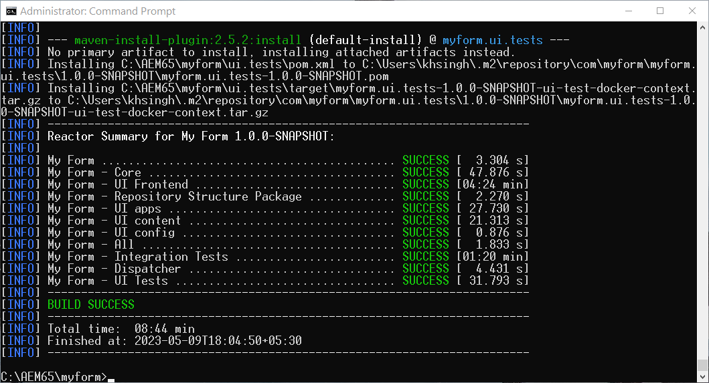

# Aktivieren von Headless Adaptive Forms auf AEM 6.5 Forms {#enable-headless-adaptive-forms-on-aem-65-forms}

Um das Headless-Adaptive Forms in Ihrer AEM 6.5 Forms-Umgebung zu aktivieren, richten Sie ein AEM Archetyp 41 oder höher-basiertes Projekt ein und stellen Sie es für alle Ihre Autoren- und Veröffentlichungsinstanzen bereit.

Durch die Bereitstellung des AEM Archetyp 41 oder höher-basierten Projekts auf Ihren Forms-Instanzen AEM 6.5 erhalten Sie die Möglichkeit, [Erstellen von Kernkomponenten-basierten adaptiven Forms](create-a-headless-adaptive-form.md). Diese Formulare werden im JSON-Format dargestellt und als Headful- und Headless-Adaptive Forms verwendet, was eine größere Flexibilität und Anpassung über verschiedene Kanäle ermöglicht, einschließlich mobiler, Web- und nativer Apps.

## Voraussetzungen {#prerequisites}

Vor der Aktivierung von Headless Adaptive Forms in AEM 6.5 Forms-Umgebung,

* [Upgrade auf AEM 6.5 Forms Service Pack 16 (6.5.16.0) oder höher](https://experienceleague.adobe.com/docs/experience-manager-65/release-notes/aem-forms-current-service-pack-installation-instructions.html).

* Installieren Sie die neueste Version von [Apache Maven](https://maven.apache.org/download.cgi).

* Installieren Sie einen Nur-Text-Editor. Beispielsweise Microsoft Visual Studio Code.

## Erstellen und Bereitstellen des neuesten AEM Archetyp-basierten Projekts

So erstellen Sie einen AEM Archetyp 41 oder [later](https://github.com/adobe/aem-project-archetype) Basiertes Projekt erstellen und für alle Autoren- und Veröffentlichungsinstanzen bereitstellen:

1. Melden Sie sich bei Ihrem Computer an, hosten Sie Ihre AEM 6.5 Forms-Instanz und führen Sie sie als Administrator aus.
1. Öffnen Sie die Eingabeaufforderung oder das Terminal.
1. Führen Sie den folgenden Befehl aus, um AEM Projektarchetyp 41 zu erstellen:

   * Microsoft Windows

   ```Shell
      mvn -B org.apache.maven.plugins:maven-archetype-plugin:3.2.1:generate ^
      -D archetypeGroupId=com.adobe.aem ^
      -D archetypeArtifactId=aem-project-archetype ^
      -D archetypeVersion=41 ^
      -D appTitle="My Form" ^
      -D appId="myform" ^
      -D groupId="com.myform" ^
      -D includeFormsenrollment="y" ^
      -D aemVersion="6.5.15" 
   ```

   * Linux oder Apple macOS

   ```Shell
      mvn -B org.apache.maven.plugins:maven-archetype-plugin:3.2.1:generate \
      -D archetypeGroupId=com.adobe.aem \
      -D archetypeArtifactId=aem-project-archetype \
      -D archetypeVersion=41 \
      -D appTitle="My Form" \
      -D appId="myform" \
      -D groupId="com.myform" \
      -D includeFormsenrollment="y" \
      -D aemVersion="6.5.15" 
   ```

   Beachten Sie beim Ausführen des oben genannten Befehls die folgenden Punkte:

   * Aktualisieren Sie den Befehl, um die spezifischen Werte für Ihre Umgebung widerzuspiegeln, einschließlich appTitle, appId und groupId. Legen Sie außerdem die Werte für includeFormsenrollment auf &quot;y&quot;fest. Wenn Sie Forms Portal verwenden, legen Sie die _includeExample=y_ , um die Kernkomponenten von Forms Portal in Ihr Projekt aufzunehmen.

   * Ändern Sie &quot;aemVersion&quot;nicht von 6.5.15.0 in etwas Anderes.

1. (Nur für Projekte, die auf Archetyp Version 41 basieren) Nachdem das AEM Archetyp-Projekt erstellt wurde, aktivieren Sie Designs für auf Kernkomponenten basierende adaptive Forms. So aktivieren Sie Designs:

   1. Öffnen Sie die [AEM Archetyp-Projektordner]/ui.apps/src/main/content/jcr_root/apps/__appId__/components/adaptiveForm/page/customheaderlibs.html zur Bearbeitung:

   1. Fügen Sie in Zeile 21 den folgenden Code hinzu:

      ```XML
      <sly data-sly-use.clientlib="core/wcm/components/commons/v1/templates/clientlib.html"
      data-sly-use.formstructparser="com.adobe.cq.forms.core.components.models.form.FormStructureParser"
      data-sly-test.themeClientLibRef="${formstructparser.themeClientLibRefFromFormContainer}">
      <sly data-sly-test="${themeClientLibRef}" data-sly-call="${clientlib.css @ categories=themeClientLibRef}"/>
      </sly>
      ```

      

   1. Speichern und schließen Sie die Datei.

1. Aktualisieren Sie das Projekt, um die neueste Version der Forms-Kernkomponenten einzuschließen:

   1. Öffnen Sie die [AEM Archetyp-Projektordner]/pom.xml zur Bearbeitung.
   1. Version von festlegen `core.forms.components.version` und `core.forms.components.af.version` nach [Aktuelle Forms-Kernkomponenten](https://github.com/adobe/aem-core-forms-components/tree/release/650) -Version.

      

   1. Speichern und schließen Sie die Datei.


1. Nachdem das AEM Archetyp-Projekt erfolgreich erstellt wurde, erstellen Sie das Bereitstellungspaket für Ihre Umgebung. Erstellen des Pakets:

   1. Navigieren Sie zum Stammverzeichnis Ihres AEM Archetypprojekts.


   1. Führen Sie den folgenden Befehl aus, um das AEM Archetyp-Projekt für Ihre Umgebung zu erstellen:

      ```Shell
      mvn clean install
      ```

      


   Nachdem das AEM Archetyp-Projekt erfolgreich erstellt wurde, wird ein AEM-Paket generiert. Sie finden das Paket unter [AEM Archetyp-Projektordner]\all\target\[appid].all-[version].zip

1. Verwenden Sie die [Package Manager](https://experienceleague.adobe.com/docs/experience-manager-65/administering/contentmanagement/package-manager.html?lang=de) zur Bereitstellung der [AEM Archetyp-Projektordner]\all\target\[appid].all-[version]ZIP-Paket auf allen Autoren- und Veröffentlichungsinstanzen.

>[!NOTE]
>
>
>
>Falls Sie Schwierigkeiten beim Zugriff auf das Anmeldedialogfeld auf einer Veröffentlichungsinstanz haben, um das Paket über Package Manager zu installieren, versuchen Sie, sich über die folgende URL anzumelden: http://[Veröffentlichungs-Server-URL]:[PORT]/system/console. Auf diese Weise können Sie auf die Anmeldung bei der Veröffentlichungsinstanz zugreifen, sodass Sie mit dem Installationsprozess fortfahren können.


Die Kernkomponenten sind für Ihre Umgebung aktiviert. Eine leere, auf Kernkomponenten basierende Vorlage für adaptives Formular und ein Canvas 3.0-Design werden in Ihrer Umgebung bereitgestellt, sodass Sie [Erstellen von Kernkomponenten-basierten adaptiven Forms](create-a-headless-adaptive-form.md).

## Häufig gestellte Fragen

### Was sind Kernkomponenten?

Die [Kernkomponenten](https://experienceleague.adobe.com/docs/experience-manager-core-components/using/introduction.html?lang=de) sind eine Reihe standardisierter Web Content Management (WCM)-Komponenten, mit denen AEM die Entwicklungszeit verkürzen und die Wartungskosten Ihrer Websites reduzieren können.

### Welche Funktionen wurden zur Aktivierung von Kernkomponenten hinzugefügt?


Wenn die adaptiven Forms-Kernkomponenten für Ihre Umgebung aktiviert sind, werden Ihrer Umgebung eine leere, auf Kernkomponenten basierende Vorlage für adaptive Formulare und ein Canvas 3.0-Design hinzugefügt. Nachdem Sie die adaptiven Forms-Kernkomponenten für Ihre Umgebung aktiviert haben, können Sie Folgendes tun:

* Erstellen Sie auf Kernkomponenten basierende adaptive Forms.
* Erstellen Sie auf Kernkomponenten basierende Vorlagen für adaptive Formulare.
* Erstellen Sie benutzerdefinierte Designs für auf Kernkomponenten basierende Vorlagen für adaptive Formulare.
* Bereitstellung der JSON-Darstellungen des auf Kernkomponenten basierenden adaptiven Formulars in Kanälen wie Mobilgeräten, Web, nativen Apps und Diensten, die die Headless-Darstellung eines Formulars erfordern.
