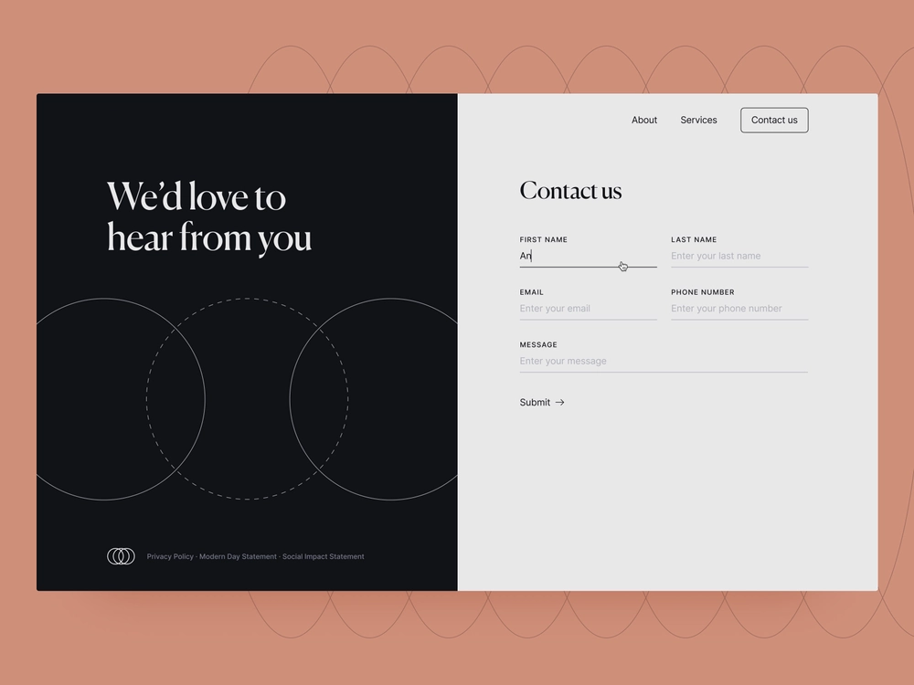

# Erste Schritte mit adaptiven Headless-Formularen

Dieses Tutorial bietet Ihnen ein End-to-End-Framework zum Erstellen eines adaptiven Headless-Formulars. Das Tutorial ist in einen Anwendungsfall und mehrere Handbücher unterteilt. Jedes Handbuch hilft Ihnen dabei, neue Funktionen zu erlernen und zum adaptiven Headless-Formular hinzuzufügen, das in diesem Tutorial erstellt wird. Sie verfügen nach jedem Handbuch über ein funktionierendes adaptives Headless-Formular. Am Ende dieses Tutorials können Sie Folgendes:

* Erstellen eines adaptiven Headless-Formulars
* Hinzufügen von Geschäftsregeln zum Formular
* Verwenden der Google Material-Benutzeroberfläche zum Formatieren von Formularen
* Vorbefüllen des Formulars
* Einbetten des Formulars in eine Webseite

Sie werden außerdem ein Verständnis der Architektur, der verfügbaren Artefakte und der JSON-Struktur von adaptiven Headless-Formularen entwickeln.

**Das Ganze beginnt mit dem Kennenlernen des Anwendungsfalls**:

Raya Tan, ein Mitglied des Außenministeriums eines Landes, das für seine natürliche Schönheit und florierende Tourismuswirtschaft bekannt ist, ist für die Ausgabe der Visaformulare an Touristinnen und Touristen zuständig. Diese Formulare stehen auf der Website des Ministeriums, in nativen Mobile Apps und im PDF-Format zur Verfügung, mit mehreren Sprachoptionen für die Touristinnen bzw. Touristen zur Auswahl. Die Verwaltung und Skalierung dieser Formulare über verschiedene Plattformen und Technologien hinweg kann jedoch eine Herausforderung darstellen.

Um die Effizienz und Flexibilität ihres Visumantragsverfahrens zu verbessern, hat das Außenministerium beschlossen, einen Ansatz mit adaptiven Headless-Formularen zu verfolgen. Diese entkoppelte Architektur trennt das Frontend vom Backend, was eine größere Anpassung und Skalierbarkeit ermöglicht. Das Ministerium plant die Verwendung der React-Komponenten der Google Material-Benutzeroberfläche, um das Kundenerlebnis der Formulare zu verbessern und gleichzeitig Backend-Funktionen wie digitale Signaturen, Datenintegration, Business Process Management, Datensatzdokumente und Nutzungsanalysen zu nutzen.

Das beliebteste Formular unter den Touristinnen und Touristen ist das Formular „Kontakt“, das verwendet wird, um verschiedene Fragen und Anfragen zu stellen. Daher hat sich das Außenministerium entschieden, bei der Implementierung des Konzepts für adaptive Headless-Formulare mit diesem Formular zu beginnen. Dieses Tutorial führt Sie durch den Prozess der Erstellung des Kontaktformulars mithilfe dieser neuen Architektur. Das Endergebnis sieht wie folgt aus:

