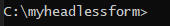
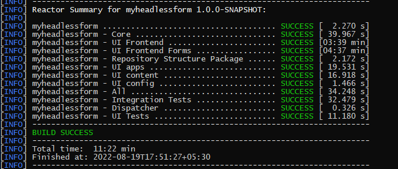
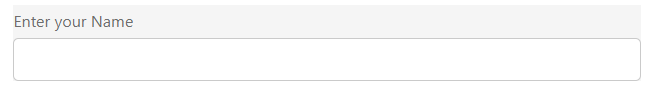
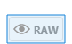
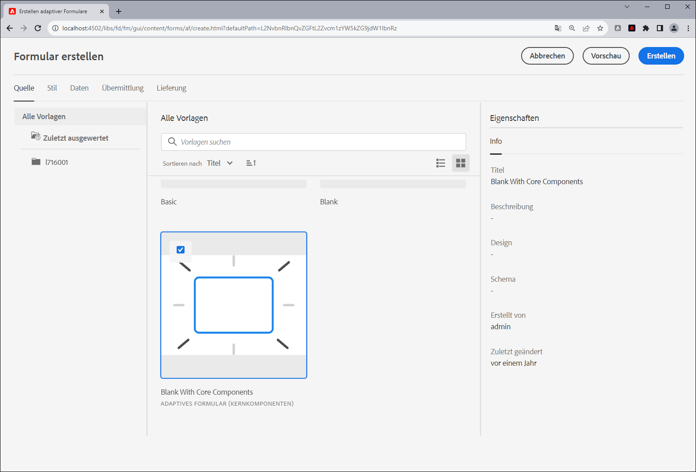

# Erstellen Ihres ersten Headless-adaptiven Formulars

Sie können adaptive Adobe Experience Manager Headless-Formulare verwenden, um Formularanwendungen mithilfe der Frontend-Benutzeroberfläche wie React zu erstellen und das Forms Web SDK für Funktionen wie Statusverwaltung, Validierung und Integrationen mit verschiedenen anderen Touchpoints zu verwenden.

Beispiel: Eine Organisation, die We.Org entwickelt, möchte ihre Journey zur Kundenregistrierung digitalisieren. Ihre Entwickler sind mit der Verwendung von Angular sehr vertraut, um Frontend-Lösungen zu erstellen. Sie möchten ein benutzerdefiniertes Frontend erstellen, während sie Formularüberprüfung und elektronische Signaturen in spezielle Lösungen abladen.

Adaptive Adobe Experience Manager Headless-Formulare bieten Unternehmen die Möglichkeit, Formulare mithilfe ihres vorhandenen Know-hows in Frontend-Sprachen zu erstellen. Gleichzeitig bieten sie Unterstützung für die Verwendung von Back-End-Funktionen zur Erstellung von Formularen der Unternehmensklasse.

<!-- >>[!VIDEO](https://video.tv.adobe.com/v/341011/) -->

<!--   -->

## Bevor Sie beginnen

* Richten Sie die [Entwicklungsumgebung](setup-development-environment.md) , damit Sie ein Headless-Adaptives Formular auf Ihrem lokalen Computer erstellen und testen können.
* Die folgende Software muss auf Ihrem lokalen Entwicklungscomputer installiert sein:
   * [Java Development Kit 11](https://experience.adobe.com/#/downloads/content/software-distribution/en/general.html?1_group.propertyvalues.property=.%2Fjcr%3Acontent%2Fmetadata%2Fdc%3AsoftwareType&amp;1_group.propertyvalues.operation=equals&amp;1_group.propertyvalues.0_values=software-type%3Atooling&amp;fulltext=Oracle%7E+JDK%7E+11%7E&amp;orderby=%40jcr%3Acontent%2Fjcr%3AlastModified&amp;orderby.sort=desc&amp;layout=list&amp;p.offset=0&amp;p.limit=14)
   * [Neueste Version von Git](https://git-scm.com/downloads). Wenn Sie mit Git noch nicht vertraut sind, lesen Sie [Installieren von Git](https://git-scm.com/book/en/v2/Getting-Started-Installing-Git).
   * [Node.js 16.13.0 oder höher](https://nodejs.org/de/download/). Wenn Sie mit Node.js noch nicht vertraut sind, lesen Sie [Installieren von Node.js](https://nodejs.dev/en/learn/how-to-install-nodejs).
   * [Maven 3.6 oder höher](https://maven.apache.org/download.cgi). Wenn Sie mit Maven noch nicht vertraut sind, lesen Sie [Installieren von Apache Maven](https://maven.apache.org/install.html).


## Verwenden Sie das Archetyp-Projekt, um ein adaptives Headless-Formular zu erstellen

Das Archetyp-Projekt ist eine maven-basierte Vorlage. Es wird ein minimales Projekt basierend auf Best Practices erstellt, um mit Headless adaptiven Formularen zu beginnen. Es enthält auch Funktionen für Headless-adaptive Formulare für as a Cloud Service und lokale Entwicklungsumgebungen von Forms. Es ist erforderlich, das auf dem Archetyp 37 oder höher basierende Projekt während der Beta-Phase zu erstellen und bereitzustellen. Nach der Betaphase ist das Projekt nur für Anpassungen erforderlich.

Führen Sie die folgenden Schritte aus, um Ihr erstes adaptives Headless-Formular zu erstellen und zu rendern:

1. [Erstellen und Bereitstellen AEM Archetyp-basierten Projekts](#create-an-archetype-based-project)
1. [Bereitstellen des Projekts im AEM SDK](#deploy-the-project-to-a-local-development-environment)
1. [Erstellen Sie das JSON-Schema des adaptiven Formulars ohne Headless und laden Sie es in Ihre AEM SDK-Instanz hoch.](#create-add-json-representation-of-headless-adaptive-forms)
1. [Erstellen eines adaptiven Formulars basierend auf der Vorlage Leere mit Kernkomponenten](#create-adaptive-form-with-blank-with-core-components-template)


### 1. Erstellen und Bereitstellen AEM Archetyp-basierten Projekts {#create-an-archetype-based-project}

Führen Sie je nach Betriebssystem den folgenden Befehl aus, um ein as a Cloud Service Experience Manager Forms-Projekt zu erstellen. Verwenden Sie den Archetyp Version 37 oder höher. Siehe [Archetyp-Dokumentation](https://experienceleague.adobe.com/docs/experience-manager-core-components/using/developing/archetype/overview.html?lang=de) um die neueste Version des Archetyps zu finden.

**Microsoft Windows**

1. Öffnen Sie die Eingabeaufforderung mit Administratorrechten (Führen Sie die Eingabeaufforderung oder die Bash-Shell als Administrator aus).
1. Führen Sie den folgenden Befehl aus:

   ```shell
     mvn -B org.apache.maven.plugins:maven-archetype-plugin:3.2.1:generate ^
     -D archetypeGroupId=com.adobe.aem ^
     -D archetypeArtifactId=aem-project-archetype ^
     -D archetypeVersion=37 ^
     -D appTitle=myheadlessform ^
     -D appId=myheadlessform ^
     -D groupId=com.myheadlessform ^
     -D includeFormsenrollment="y" ^
     -D includeFormsheadless="y" 
   ```

   * Satz `appTitle` , um den Titel und die Komponentengruppen zu definieren.
   * Satz `appId` um die Maven-Artefakt-ID, die Namen der Komponenten-, Konfigurations- und Inhaltsordner sowie der Client-Bibliotheken zu definieren.
   * Satz `groupId` , um die Maven-groupId und das Java-Quellpaket zu definieren.
   * Verwenden Sie die Option `includeFormsenrollment=y` zum Einschließen von Forms-spezifischen Konfigurationen, Designs, Vorlagen, Kernkomponenten und Abhängigkeiten, die zum Erstellen adaptiver Formulare erforderlich sind.
   * Verwenden Sie die `includeFormsheadless=y` Option zum Einschließen von Forms-Kernkomponenten und Abhängigkeiten, die erforderlich sind, um die Headless-Funktion für adaptive Forms einzuschließen. Wenn Sie diese Option aktivieren, sind folgende Optionen enthalten:
      * Die **Leer mit Kernkomponenten** Vorlage mit [Kernkomponenten](https://experienceleague.adobe.com/docs/experience-manager-core-components/using/introduction.html?lang=de).
      * ein Frontend-React-Modul, `ui.frontend.react.forms.af`. Dies hilft Ihnen, das Headless-adaptive Formular in einer React-App zu rendern.


**Apple macOS oder Linux**:

1. Öffnen Sie Terminal als Root-Benutzer. Damit können Sie Befehle mit Administratorrechten ausführen. Sie können auch `sudo root` nach dem Öffnen des Terminalfensters, um Befehle mit Administratorrechten auszuführen.
1. Führen Sie den folgenden Befehl aus:

   ```shell
     mvn -B org.apache.maven.plugins:maven-archetype-plugin:3.2.1:generate \
     -D archetypeGroupId=com.adobe.aem \
     -D archetypeArtifactId=aem-project-archetype \
     -D archetypeVersion=37 \
     -D appTitle=myheadlessform \
     -D appId=myheadlessform \
     -D groupId=com.myheadlessform \
     -D includeFormsenrollment="y" \
     -D includeFormsheadless="y"  
   ```

   * Satz `appTitle` , um den Titel und die Komponentengruppen zu definieren.
   * Satz `appId` , um die Maven-Artefakt-ID, die Komponenten-, Konfigurations-, Inhaltsordnernamen und die Namen der Client-Bibliotheken zu definieren.
   * Satz `groupId` , um die Maven-groupId und das Java-Quellpaket zu definieren.
   * Verwenden Sie die Option `includeFormsenrollment=y` zum Einschließen von Forms-spezifischen Konfigurationen, Designs, Vorlagen, Kernkomponenten und Abhängigkeiten, die zum Erstellen adaptiver Formulare erforderlich sind.
   * Verwenden Sie die `includeFormsheadless=y` Option zum Einschließen von Forms-Kernkomponenten und Abhängigkeiten, die erforderlich sind, um die Headless-Funktion für adaptive Forms einzuschließen. Wenn Sie diese Option aktivieren, sind folgende Optionen enthalten:
      * Die **Leer mit Kernkomponenten** Vorlage mit [Kernkomponenten](https://experienceleague.adobe.com/docs/experience-manager-core-components/using/introduction.html?lang=de).
      * ein Frontend-Reaktionsmodul, `ui.frontend.react.forms.af`. Dies hilft Ihnen, das Headless-adaptive Formular in einer React-App zu rendern.

Nach erfolgreichem Abschluss des Befehls wird ein Projektordner mit dem im `appID` erstellt wird. Wenn Sie beispielsweise `appID` mit Wert `myheadlessform`, einen Ordner mit dem Namen `myheadlessform` erstellt wird. Es enthält das auf Archetypen basierende Projekt.


### 2. Bereitstellen des Projekts im AEM SDK {#deploy-the-project-to-a-local-development-environment}

Wenn Sie das Projekt in Ihrer AEM SDK-Instanz bereitstellen, wird die Funktion &quot;Headless Adaptive Forms&quot;, die **Leer mit Kernkomponenten** und anderen Ressourcen, die im Projekt für Ihre Entwicklungsumgebung enthalten sind. <!-- Deploy the project to your local development environment to locally create Headless Adaptive Forms. or deploy directly to your Forms as a Cloud Service environment. !--> So stellen Sie Folgendes für Ihre AEM SDK-Instanz bereit:

1. Öffnen Sie die Eingabeaufforderung. Wenn Sie sich unter Windows befinden, öffnen Sie die Eingabeaufforderung mit Administratorrechten (Eingabeaufforderung ausführen oder [Git-Bash-Shell](https://khushwantsehgal.wordpress.com/2022/06/29/check-if-git-bash-is-running-in-administrator-mode/)  als Administrator).

1. Navigieren Sie zum Projektverzeichnis, das im vorherigen Schritt erstellt wurde. Zum Beispiel: `/myheadlessform`

   

1. Führen Sie den folgenden Befehl aus:

   ```shell
   mvn -PautoInstallPackage clean install
   ```

   Warten Sie auf die Meldung &quot;BUILD SUCCESS&quot;.
   

   Es kann lange dauern, die Abhängigkeiten aufzulösen und das Projekt bereitzustellen. Wenn die Bereitstellung des Projekts fehlschlägt, lesen Sie [Fehlerbehebung](troubleshooting.md) Artikel über allgemeine Fragen und deren Lösung.


<!-- *  To learn how to deploy code to AEM as a Cloud Service, see the video in [Deploying to AEM as a Cloud Service]https://experienceleague.adobe.com/docs/experience-manager-cloud-service/content/implementing/deploying/overview.html?lang=en#coding-against-the-right-aem-version) article : -->


### 3. Erstellen Sie das JSON-Schema des Headless-adaptiven Formulars und laden Sie es in Ihre AEM SDK-Instanz hoch {#create-add-json-representation-of-headless-adaptive-forms}

Eine Headless-Adaptive Forms wird als JSON-Datei dargestellt. Sie können ein Beispielformular aus [Storybook](https://opensource.adobe.com/aem-forms-af-runtime/storybook/?path=/story/reference-examples--contact) oder verwenden Sie die Beispielformulareinträge im Archetyp-Projekt unter `[Archetype Project]\ui.content\src\main\content\jcr_root\content\dam\myheadlessform\af_model_sample.json`. Dieses Dokument verwendet die [introduction](https://opensource.adobe.com/aem-forms-af-runtime/storybook/?path=/story/reference-examples--introduction) Formular aus Storybook. Es ist ein einzelnes Feldformular, mit dem Sie schnell mit dem Headless Adaptive Forms beginnen können. <!-- The [specifications](/help/assets/Headless-Adaptive-Form-Specification.pdf) document provides detailed information about various components, rules, and constraints for Headless Adaptive Forms -->

So erstellen und laden Sie das Schema hoch:

1. Erstellen einer Textdatei mit Erweiterung `.json`. Beispiel: `myfirstform.json`. Sie können die Datei an einer beliebigen Stelle in Ihrem Dateisystem oder in Ihrem AEM Archetyp-basierten Projekt erstellen unter `\<project-name>\ui.content\src\main\content\jcr_root\content\dam\myheadlessform\<formname>.json`
1. Fügen Sie den folgenden JSON-Inhalt zu Ihrem `.json` und speichern Sie sie:

   ```JSON
   {
     "adaptiveform": "0.10.0",
     "items": [
       {
         "fieldType": "text-input",
         "label": {
           "value": "Enter your Name"
         },
         "name": "textInput"
       }
     ],
     "metadata": {
       "grammar": "json-formula-1.0.0",
       "version": "1.0.0"
     }
   }
   ```

   Es wird ein einzelnes Feld zum Formular hinzugefügt:

   

1. Melden Sie sich bei Ihrer [lokale AEM SDK-Instanz](setup-development-environment.md#setup-author-instance)
1. Navigieren Sie zu Adobe Experience Manager > Forms > Forms und Dokumente. Tippen Sie auf Erstellen > Datei hochladen.
1. Wählen Sie die `.json` in Schritt 2 erstellt und hochgeladen werden. Sie sind bereit, das Headless-Adaptive Formular zu erstellen. Wenn Sie die JSON-Datei in Ihrem AEM Archetyp-basierten Projekt speichern unter `\<project-name>\ui.content\src\main\content\jcr_root\content\dam\myheadlessform\<formname>.json`. Sie können die `mvn -PautoInstallPackage clean install` , um das Projekt in Ihrem AEM SDK bereitzustellen und `<formname>.json` mit ihm.

Wenn beim Hochladen der `.json`stellen sicher, dass [AEM Archetyp-Projekt wurde erfolgreich bereitgestellt](#deploy-the-project-to-a-local-development-environment).

<!-- 1. Open the [contact form](https://opensource.adobe.com/aem-forms-af-runtime/storybook/?path=/story/reference-examples--contact) and tap the [](faq.md#storybook-example) icon on bottom-right side of the Storybook page to view the source code of the headless . 

You can use [Adaptive Forms builder extension for Visual Studio Code](/help/setup-development-environment.md#microsot-visual-studio-code-extension-for-headless-adaptive-forms) to build a JSON schema of your Headless Adaptive Forms. 

You can see [Storybook](https://opensource.adobe.com/aem-forms-af-runtime/storybook/?path=/story/reference-examples--introduction) for sample JSON schemas and list of components, attributes, and properties. You can also see the [specifications document](/help/assets/Headless-Adaptive-Form-Specification.pdf) for detailed information on all the components, constraints, and methods available to define Headless Adaptive Forms.

File extension of a JSON schema of Headless Adaptive Forms is .json. For example, formname.json. Create or add the file to your AEM Archetype based project. For example, `\myheadlessform\ui.content\src\main\content\jcr_root\content\dam\myheadlessform\home-loan.json` -> 

### 3. Deploy the project to a local development environment {#deploy-the-project-to-a-local-development-environment}

You can deploy the project to local development environment. It adds Headless Adaptive Forms functionality, the **Blank with core components** template, JSON schema of form, and other resources included in the project to your development environment. <!-- Deploy the project to your local development environment to locally create Headless Adaptive Forms. or deploy directly to your Forms as a Cloud Service environment. To deploy to your local development environment, use the following command: 

    `mvn -PautoInstallPackage clean install`

If you are on Windows, run the above with Administrative privileges (Run command prompt or [bash shell as an administrator](https://khushwantsehgal.wordpress.com/2022/06/29/check-if-git-bash-is-running-in-administrator-mode/)). For the complete list of commands, see [Building and Installing](https://experienceleague.adobe.com/docs/experience-manager-core-components/using/developing/archetype/using.html?lang=en#building-and-installing).
    
<!-- *  To learn how to deploy code to AEM as a Cloud Service, see the video in [Deploying to AEM as a Cloud Service]https://experienceleague.adobe.com/docs/experience-manager-cloud-service/content/implementing/deploying/overview.html?lang=en#coding-against-the-right-aem-version) article : -->

### 4. Erstellen Sie ein adaptives Formular basierend auf der Vorlage Leeres Formular mit Kernkomponenten . {#create-adaptive-form-with-blank-with-core-components-template}

1. Melden Sie sich bei Ihrer [AEM SDK-Instanz](http://localhost:4502/).

1. Navigieren Sie zu Adobe Experience Manager > Forms > Forms und Dokumente.

1. Tippen Sie auf Erstellen und wählen Sie Adaptives Formular. Wählen Sie die **Leer mit Kernkomponenten** und tippen Sie auf Erstellen.

   

1. Geben Sie die Werte für die folgenden Eigenschaftsfelder an. Die Felder „Titel“ und „Name“ sind obligatorisch.

   * **Titel**: Gibt den Anzeigenamen des Formulars an. Der Titel erleichtert Ihnen die Identifizierung des Formulars in der Benutzeroberfläche von Experience Manager Forms.
   * **Name**: Gibt den Namen des Formulars an. Im Repository wird ein Knoten mit dem angegebenen Namen erstellt. Wenn Sie mit der Eingabe des Titels beginnen, wird automatisch ein Wert für das Feld „Name“ vorgeschlagen. Sie können den vorgeschlagenen Wert gegebenenfalls ändern. Im Feld „Name“ dürfen nur alphanumerische Zeichen, Bindestriche und Unterstriche eingegeben werden. Alle ungültigen Eingaben werden durch Bindestriche ersetzt.

1. Tippen Sie auf Erstellen. Ein adaptives Formular wird erstellt.

Wenn die Variable **Leer mit Kernkomponenten** -Vorlage, stellen Sie sicher, dass die [AEM Archetyp-Projekt wurde erfolgreich bereitgestellt](#deploy-the-project-to-a-local-development-environment).

### 5. Konfigurieren Sie das adaptive Formular für die Verwendung des JSON-Schemas {#configure-adaptive-form-to-use-the-JSON-representation}

Das im vorherigen Schritt erstellte adaptive Formular ist leer. Konfigurieren Sie das adaptive Formular für die Verwendung des JSON-Schemas:

1. Melden Sie sich bei Ihrer [AEM SDK-Instanz](http://localhost:4502/).

1. Navigieren Sie zu Adobe Experience Manager > Forms > Forms und Dokumente. Wählen Sie das im vorherigen Schritt erstellte adaptive Formular aus und tippen Sie auf Bearbeiten. Das adaptive Formular wird im Editor geöffnet.

1. Tippen Sie auf die Komponente Adaptiver Forms-Container und dann auf Eigenschaften . Es zeigt den Eigenschaften-Explorer in der Seitenleiste an.

1. Erweitern Sie im Eigenschaften-Explorer das Akkordeon BASIC und geben Sie den Pfad des JSON-Schemas an, das in einem vorherigen Schritt für die Option Forms Runtime Document Path hochgeladen wurde. Die Container-Komponente zeigt eine Ausgabe des Formulars an.

1. Erweitern Sie im Eigenschaften-Explorer das Akkordeon Sende und legen Sie eine Übermittlungsaktion für das adaptive Formular fest. Ihr Formular kann jetzt in einer React-App verwendet werden.

1. So rendern Sie das Formular auf Ihrem lokalen Entwicklungscomputer:

   1. Öffnen Sie die `[Archetype project]\ui.frontend.react.forms.af\.env` und legen Sie den Pfad des Formulars fest. Beispiel: /content/forms/af/contact

   1. Öffnen Sie die Eingabeaufforderung, navigieren Sie zum Projekt ui.frontend.react.forms.af und führen Sie den folgenden Befehl aus:

      `npm run start`

   1. Öffnen Sie nach Abschluss das Feld localhost:3000 in Ihrem Browserfenster, um das wiedergegebene Headless-Adaptive Formular anzuzeigen.
   1. Um die Sendefunktion zu testen, melden Sie sich bei Ihrem AEM Forms-Server an und verwenden Sie die **Vorschau des Formulars auf HTML** -Option, um das Formular im Vorschaumodus zu öffnen.

Die [Storybook](https://opensource.adobe.com/aem-forms-af-runtime/storybook/) bietet eine Liste von Komponenten und Regeln, die auf verschiedenen Headless Adaptive Forms festgelegt werden können, sowie ein Beispiel für ein JSON-Schema des Headless Adaptive Forms. Sie können auch [Spezifikationen](/help/assets/Headless-Adaptive-Form-Specification.pdf) -Dokument, um mehr über verschiedene Regeln und Eigenschaften im Zusammenhang mit Headless Adaptive Forms zu erfahren.
