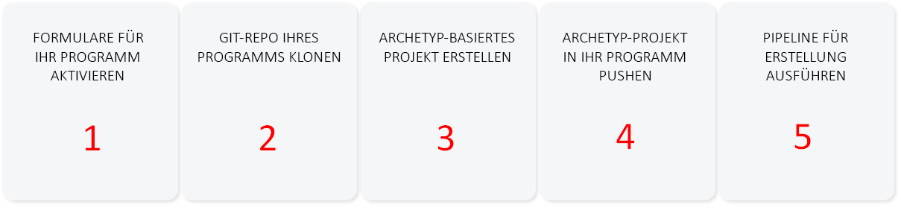
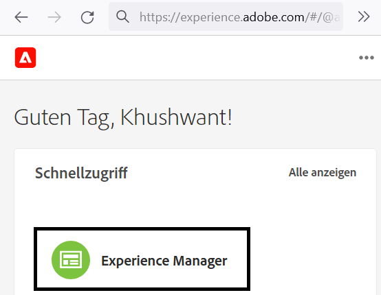
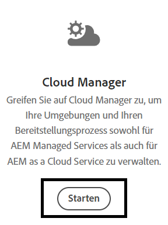
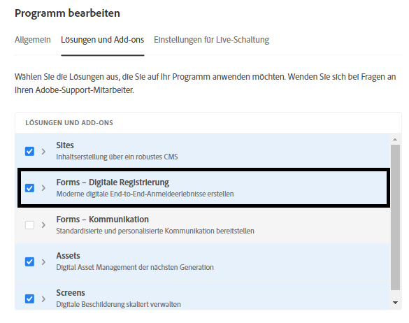
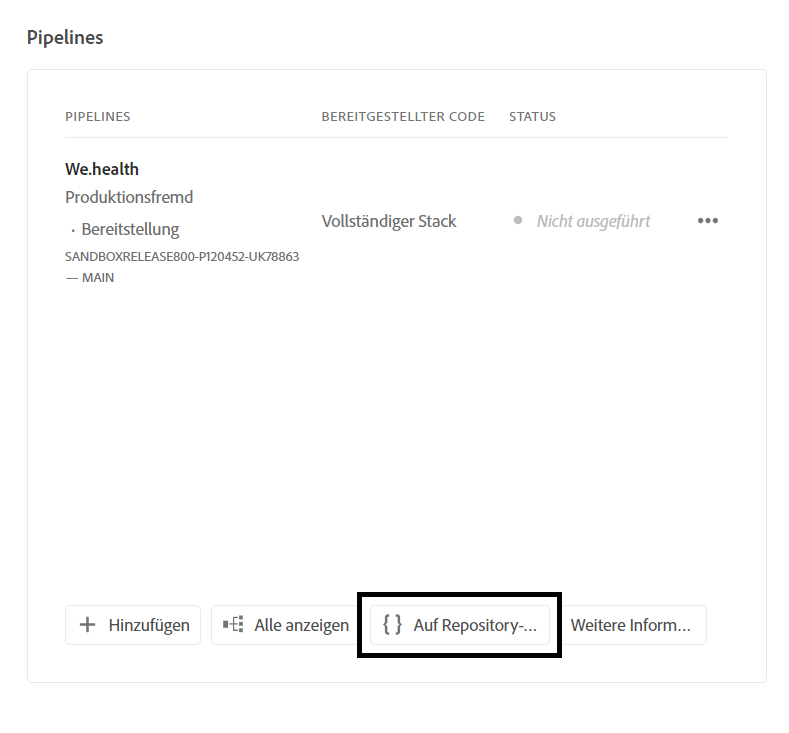
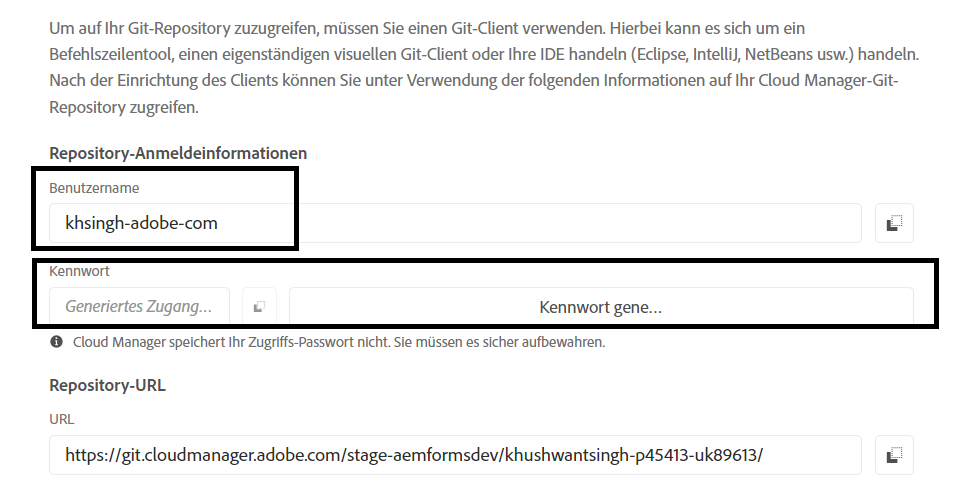
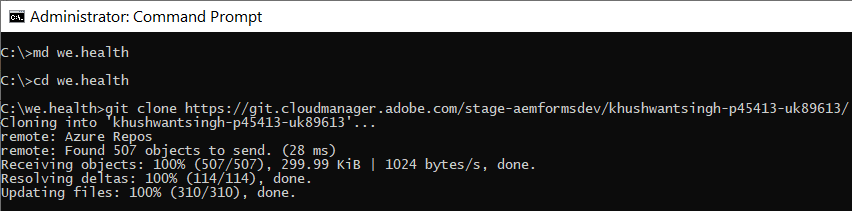
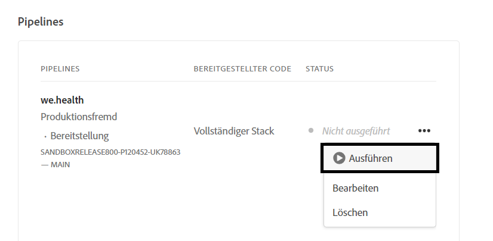

# Entwicklungsumgebung für Headless-adaptive Formulare auf dem Cloud Service einrichten

<span class="preview"> Dies ist ein **FORTSCHRITTLICHE ARBEIT** Artikel.</span>


Bereit zum Erstellen und Testen von Headless-adaptiven Formularen auf Cloud Service? Aktivieren Sie Forms für Ihr Cloud Service-Programm und fahren Sie fort.

## Bevor Sie beginnen

* Installieren [Neueste Version von Git](https://git-scm.com/downloads) auf Ihrem lokalen Computer. Wenn Sie mit Git noch nicht vertraut sind, lesen Sie [Installieren von Git](https://git-scm.com/book/en/v2/Getting-Started-Installing-Git). Sie verwenden das Git-Repository, um die in Ihrer lokalen Entwicklungsumgebung entwickelten Formulare und benutzerdefinierten Code in Ihre Cloud Service-Entwicklungsumgebung zu übertragen.

* Installieren [Node.js 16.13.0 oder höher](https://nodejs.org/de/download/) auf Ihrem lokalen Computer. Wenn Sie mit Node.js noch nicht vertraut sind, lesen Sie [Installieren von Node.js](https://nodejs.dev/en/learn/how-to-install-nodejs).

* Erstellen Sie ein AEM as a Cloud Service Programm: Folgen Sie den Schritten 1-7 des [Programm erstellen](https://experienceleague.adobe.com/docs/experience-manager-cloud-service/content/onboarding/demo-add-on/create-program.html?#create-program) -Artikel, um ein Programm für Ihre Organisation zu erstellen.

* Aktivieren [Vorabversionskanal für Ihr Cloud Service-Programm](https://experienceleague.adobe.com/docs/experience-manager-cloud-service/content/release-notes/prerelease.html?cloud-environments).

## Arbeitsablauf einrichten

Aktivieren Sie zum Aktivieren von Headless-adaptiven Formularen in Ihrer as a Cloud Service Forms-Sandbox `Forms - Digital enrolment` -Lösung für Ihr AEM Cloud Service-Programm erstellen Sie ein auf Ihrem lokalen Computer basierendes Archetyp 37 oder höher-Projekt und pushen Sie es in Ihre as a Cloud Service Forms-Umgebung. Der vollständige Prozess ist:



### 1. Forms für Ihr Programm aktivieren

<table style="table-layout:auto">
<tr>
  <td>
  1. Anmelden bei <a href="https://experience.adobe.com/" > https://experience.adobe.com/ </a>  und wählen Sie die <b> Experience Manager </b> -Option.
  </td>
  <td>
    <a href="https://experienceleague.adobe.com/docs/experience-manager-cloud-service/content/onboarding/demo-add-on/create-program.html?#create-program">
      
    </a>
    <br>
  </td>
</tr>
<tr>
  <td>
  2. Für die <b> Cloud Manager </b> Option, klicken Sie auf <b> Starten Sie. </b> Eine Liste der Programme für Ihre Organisation wird angezeigt.
  </td>
  <td>
    <a href="https://experienceleague.adobe.com/docs/experience-manager-cloud-service/content/onboarding/demo-add-on/create-program.html?#create-program">
      
    </a>
    <br>
  </td>
</tr>
<tr>
  <td>
    3. Tippen Sie für Ihr Programm auf das Symbol ... und wählen Sie die <b> Programm bearbeiten </b> -Option. Folgendes Dialogfeld wird angezeigt. 
  </td>
  <td>
    <a href="https://experienceleague.adobe.com/docs/experience-manager-cloud-service/content/onboarding/demo-add-on/create-program.html?#create-program">
      
    </a>
    <br>
  </td>
</tr>
<tr>
  <td>
    4. Navigieren Sie im Dialogfeld Programm bearbeiten zum <b> Registerkarte "Lösungen und Add-ons" </b>, wählen Sie die <b> Forms - Digitale Registrierung </b> und tippen Sie auf <b> update </b>. 
  </td>
  <td>
    <a href="https://experienceleague.adobe.com/docs/experience-manager-cloud-service/content/onboarding/demo-add-on/create-program.html?#create-program">
      
    </a>
    <br>
  </td>
</tr>
</table>

### 2. Klonen Sie das Git-Repository Ihres Programms auf Ihrem lokalen Computer

Jedes AEM as a Cloud Service Programm verfügt über ein Git-Repository. Sie können damit benutzerdefinierten Code und Assets von einem lokalen Computer in Ihre Cloud Service-Umgebung hochladen. Während des Setups verwenden wir das Git-Repository, um Headless-adaptiven Formularcode, Vorlagen und andere Informationen von Ihrem lokalen Cloud Service in Ihr Programm zu übertragen. Das Klonen des Cloud Service-Git-Repositorys auf Ihrem lokalen Computer ist der erste Schritt, um benutzerdefinierten Code und Inhalt von Ihrem lokalen Computer in den Cloud Service zu bringen.

>[!INFO]
>
> Sie können jederzeit zu einem Git-Repository verpflichten, ohne es zu klonen. Aber es hat seine eigenen Quirks. Wir verwenden also den Klonansatz in diesem Dokument.


Klonen des Repositorys:

<table style="table-layout:fixed">
<tr>
  <td>
  1. Tippen Sie in der Pipeline-Box Ihres Programms auf <b> Zugriff auf Repo Info. </b> Ein Dialogfeld mit Repository-Informationen wird angezeigt 
  </td>
  <td>
    <a href="https://experienceleague.adobe.com/docs/experience-manager-cloud-service/content/onboarding/demo-add-on/create-program.html?#create-program">
      
    </a>
    <br>
  </td>
</tr>
<tr>
  <td>
  2. Tippen Sie <b> Kennwort generieren </b> und kopieren Sie die <b> Repository-URL. </b> 
  </td>
  <td>
      
    <br>
  </td>
</tr>
<tr>
  <td>
    3. Öffnen Sie auf Ihrem lokalen Computer die Eingabeaufforderung, erstellen Sie einen Ordner, führen Sie den folgenden Befehl aus und geben Sie die Repository-Anmeldeinformationen ein, wie hier beschrieben:
    </br>
    <code> git clone [Repository URL] </code> </br></br>
    Beispiel: </br> 
    <code> git clone https://git.cloudmanager.adobe.com/stage-aemformsdev/khushwantsingh-p45413-uk89613/ </code>

</br> Wenn Sie gefragt werden, rufen Sie die <b> Benutzername</b> und <b>Passwort</b> aus dem <b>Repository-Informationen</b> angezeigt.
</td>
  <td>
     
  </td>
</tr>
</table>


### 3. Erstellen Sie ein AEM Archetyp-basiertes Projekt

Das Archetyp-Projekt ist eine maven-basierte Vorlage. Es wird ein minimales Projekt basierend auf Best Practices erstellt, um mit Headless adaptiven Formularen zu beginnen. Es enthält auch die Kernfunktionen für adaptive Formulare mit Headless-Funktionalität für Forms as a Cloud Service. Es ist erforderlich, das auf dem Archetyp 37 oder höher basierende Projekt zu erstellen und bereitzustellen.
®®® Führen Sie je nach Betriebssystem den Befehl maven aus, um ein as a Cloud Service Experience Manager Forms-Projekt zu erstellen. Verwenden Sie den Archetyp Version 37 oder höher. Siehe [Archetyp-Dokumentation](https://experienceleague.adobe.com/docs/experience-manager-core-components/using/developing/archetype/overview.html?lang=de) um die neueste Version des Archetyps zu finden.

+++ Microsoft® Windows

1. Öffnen Sie die Eingabeaufforderung mit Administratorrechten (Führen Sie eine Eingabeaufforderung oder eine Bash-Shell als Administrator aus).
1. Führen Sie den folgenden Befehl aus:

   ```shell
     mvn -B org.apache.maven.plugins:maven-archetype-plugin:3.2.1:generate ^
     -D archetypeGroupId=com.adobe.aem ^
     -D archetypeArtifactId=aem-project-archetype ^
     -D archetypeVersion=37 ^
     -D appTitle=myheadlessform ^
     -D appId=myheadlessform ^
     -D groupId=com.myheadlessform ^
     -D includeFormsenrollment="y" ^
     -D includeFormsheadless="y" 
   ```

™™ * Satz `appTitle` , um den Titel und die Komponentengruppen zu definieren.
* Satz `appId` um die Maven-Artefakt-ID, die Namen der Komponenten-, Konfigurations- und Inhaltsordner sowie der Client-Bibliotheken zu definieren.
* Satz `groupId` , um die Maven-groupId und das Java™-Quellpaket zu definieren.
* Verwenden Sie die Option `includeFormsenrollment=y` zum Einschließen von Forms-spezifischen Konfigurationen, Designs, Vorlagen, Kernkomponenten und Abhängigkeiten, die zum Erstellen adaptiver Formulare erforderlich sind.
* Verwenden Sie die `includeFormsheadless=y` Option zum Einschließen von Forms-Kernkomponenten und Abhängigkeiten, die erforderlich sind, um die Funktion für Headless-adaptive Formulare einzuschließen. Wenn Sie diese Option aktivieren, sind folgende Optionen enthalten:\
* Die **Leer mit Kernkomponenten** Vorlage mit [Kernkomponenten](https://experienceleague.adobe.com/docs/experience-manager-core-components/using/introduction.html?lang=de).
* ein Frontend-React-Modul, `ui.frontend.react.forms.af`. Dies hilft Ihnen beim Rendern des Headless-adaptiven Formulars in einer React-App.

+++®®®


+++ Apple macOS oder Linux®

1. Öffnen Sie Terminal als Root-Benutzer. Damit können Sie Befehle mit Administratorrechten ausführen. Sie können auch `sudo root` nach dem Öffnen des Terminalfensters, um Befehle mit Administratorrechten auszuführen.
1. Führen Sie den folgenden Befehl aus:

   ```shell
     mvn -B org.apache.maven.plugins:maven-archetype-plugin:3.2.1:generate \
     -D archetypeGroupId=com.adobe.aem \
     -D archetypeArtifactId=aem-project-archetype \
     -D archetypeVersion=37 \
     -D appTitle=myheadlessform \
     -D appId=myheadlessform \
     -D groupId=com.myheadlessform \
     -D includeFormsenrollment="y" \
     -D includeFormsheadless="y"  
   ```

™™ * Satz `appTitle` , um den Titel und die Komponentengruppen zu definieren.
* Satz `appId` , um die Maven-Artefakt-ID, die Komponenten-, Konfigurations-, Inhaltsordnernamen und die Namen der Client-Bibliotheken zu definieren.
* Satz `groupId` , um die Maven-groupId und das Java™-Quellpaket zu definieren.
*  Verwenden Sie die Option `includeFormsenrollment=y` zum Einschließen von Forms-spezifischen Konfigurationen, Designs, Vorlagen, Kernkomponenten und Abhängigkeiten, die zum Erstellen adaptiver Formulare erforderlich sind.
* Verwenden Sie die `includeFormsheadless=y` Option zum Einschließen von Forms-Kernkomponenten und Abhängigkeiten, die erforderlich sind, um die Funktion für Headless-adaptive Formulare einzuschließen. Wenn Sie diese Option aktivieren, sind folgende Optionen enthalten:\
* Die **Leer mit Kernkomponenten** Vorlage mit [Kernkomponenten](https://experienceleague.adobe.com/docs/experience-manager-core-components/using/introduction.html?lang=de).
* Ein Frontend-Reaktionsmodul, `ui.frontend.react.forms.af`. Dies hilft Ihnen beim Rendern des Headless-adaptiven Formulars in einer React-App.

+++

Nach erfolgreichem Abschluss des Befehls wird ein Projektordner mit dem im `appID` erstellt wird. Wenn Sie beispielsweise `appID` mit Wert `myheadlessform`, einen Ordner mit dem Namen `myheadlessform` erstellt wird. Es enthält das auf Archetypen basierende Projekt.

### 4. Push the AEM Archetyp-based project to your Cloud Service environment

1. Ersetzen Sie den Inhalt des Git-Repositorys durch den Inhalt eines auf dem Archtype-basierten Projekts.

   >[!VIDEO](https://video.tv.adobe.com/v/3409809/)

1. Öffnen Sie die Eingabeaufforderung, navigieren Sie zum Ordner &quot;Git-Repository&quot;und führen Sie die folgenden Befehle in der aufgelisteten Reihenfolge aus, um den ersetzten Inhalt in Ihre Cloud Service-Umgebung hochzuladen. Sie können auch einen visuellen Editor verwenden, anstatt die folgenden Befehle zum Pushen von Inhalten in das Cloud Service-Repository zu verwenden.

   ```
      git add .
      git commit
      git push origin
   ```

### 5. Ausführen der Build-Pipeline für Ihr Programm


<table style="table-layout:auto">
<tr>
  <td>
  1. Anmelden bei <a href="https://experience.adobe.com/" > https://experience.adobe.com/ </a>  und wählen Sie die <b> Experience Manager </b> -Option.
  </td>
  <td>
    <a href="https://experienceleague.adobe.com/docs/experience-manager-cloud-service/content/onboarding/demo-add-on/create-program.html?#create-program">
      
    </a>
    <br>
  </td>
</tr>
<tr>
  <td>
  2. Für die <b> Cloud Manager </b> Option, klicken Sie auf <b> Starten Sie. </b> Eine Liste der Programme für Ihre Organisation wird angezeigt. Öffnen Sie Ihr Programm. 
  </td>
  <td>
    <a href="https://experienceleague.adobe.com/docs/experience-manager-cloud-service/content/onboarding/demo-add-on/create-program.html?#create-program">
      
    </a>
    <br>
  </td>
</tr>
<tr>
  <td>
    3. Tippen Sie für Ihre Pipeline auf das Symbol ... und wählen Sie die <b> Ausführen </b> -Option. Tippen Sie bei Aufforderung zur Ausführung der Pipeline auf <b> Ausführen </b> und auf Pipeline warten <b> Status </b>  , um <b> Abgeschlossen </b>.  
  </td>
  <td>
    <a href="https://experienceleague.adobe.com/docs/experience-manager-cloud-service/content/onboarding/demo-add-on/create-program.html?#create-program">
      
    </a>
    <br>
  </td>
</tr>
</table>

Jetzt kann Ihre Umgebung adaptive Formulare ohne Kopfzeilenfunktion verwenden. Sie können jetzt die JSON-Definition eines Formulars in Ihre Cloud Service-Umgebung hochladen, ein darauf basierendes adaptives Headless-Formular erstellen und die [getForm](https://opensource.adobe.com/aem-forms-af-runtime/api/#tag/Get-Form-Definition/operation/getForm) und anderen Rest-APIs, um das adaptive Headless-Formular in Ihrer Anwendung oder Ihrem Dienst zu verwenden.
